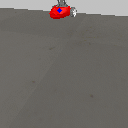
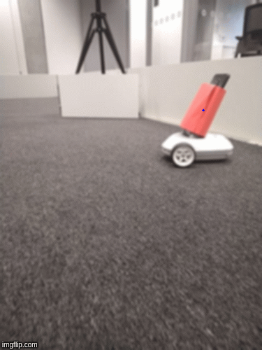
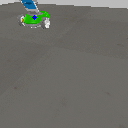
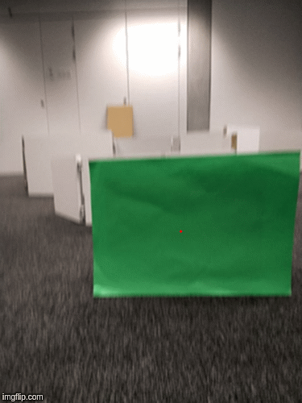

## Deep Q-Learning
by Ilze Amanda Auzina (ilze.amanda.auzina@gmail.com) and Suzanne Bardelmeijer(suzanne-bardelmeijer@live.nl)  

# Abstract 
This document contains the final report on the course Learning Machines given at the Vrije Universiteit Amsterdam in January 2020.  Deep Q-Learning learn-ing method was investigated as an optimal solution for three tasks: (1) obstacle avoidance, (2) foraging and (3) predator-prey behaviour.  The performance wasevaluated both in simulation and in real-life.  The final results indicate that the chosen method is an appropriate solution for the tasks at hand, as the goal of eachtask was achieved. The reality-gap caused minor difficulties, however they were overcome as the project progressed.  Therefore, the present papers confirms theexisting literature that deep-reinforcement learning can be successfully applied to learning machines both in simulation and real-life.

For a complete explanation of the model/implementation and the findings, please read the `report.pdf`.

# Contents
This repository contains partial code to run DeepRF simulations in software VREP (CoppeliaSim EduV4.0.0), and in hardware, ’Robobo’ an educational robot. Code is written in python 2.7 and the package ’Tensorflow 2.2.4.’ was used for the designs ofthe neural networks. 

The repository only contains the relevant code for the model itslef (not all the depencies for the hardware and simulation software to run). 

src directory
- send_commands.py contains the training and execution mode for 3 expriments 

nn_network
- nn.py containts the 'controller' (model architecture, optimization algoritm used) 

# Results

For some fun insights here are some gifs of results. Prey was marked in red, hence the preditor had to detec red color:

_Simulation_               |  _Reality_
:-------------------------:|:-------------------------:
     |  

The preditor was marked in green. Hence the prey had to learn to detect and 'run-away' from color green:

_Simulation_               |  _Reality_
:-------------------------:|:-------------------------:
     |  

